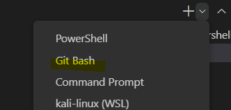

# MCDX2022.AgentCat

A VScode SFML project  
Refer https://github.com/rewrking/sfml-vscode-boilerplate

## Setup

### Required files

- Download [SFML 2.5.1 - GCC 7.3.0 MinGW (DW2) 32-bit (for Windows)](https://www.sfml-dev.org/files/SFML-2.5.1-windows-gcc-7.3.0-mingw-32-bit.zip)
- Download [GCC 7.3.0 MinGW (DW2) 32-bit (for Windows)](https://sourceforge.net/projects/mingw-w64/files/Toolchains%20targetting%20Win32/Personal%20Builds/mingw-builds/7.3.0/threads-posix/dwarf/i686-7.3.0-release-posix-dwarf-rt_v5-rev0.7z/download)
- Donwload [Git Bash (for Windows)](https://git-scm.com/downloads)

### Steps

1. Drag **SFML-2.5.1** and **mingw32** to C:// by default
2. Install Git Bash in order to have bash command
3. Open the project by vscode and install the official C++ extension

## Build and Release

- Select Git Bash  
  
- Press **Ctrl+Shift+b** or use ommand  
  `bash ./build.sh buildrun [Release/Debug] vscode`
